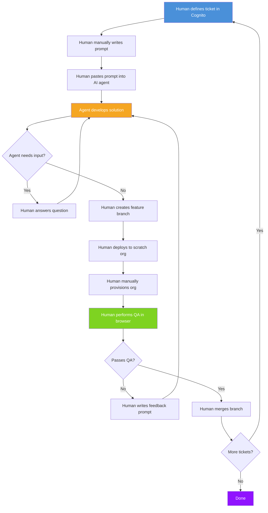
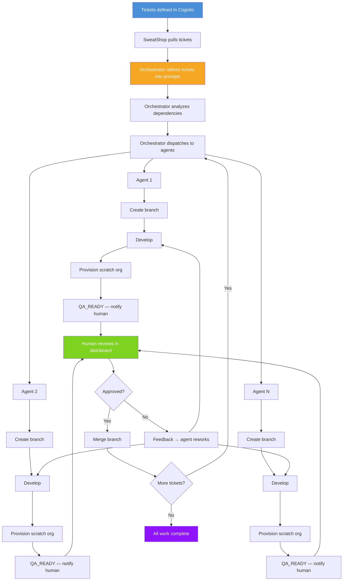
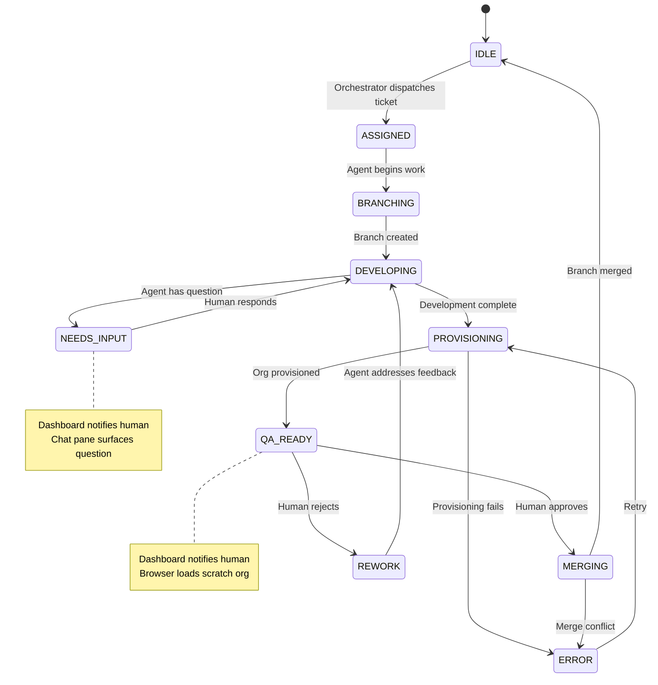
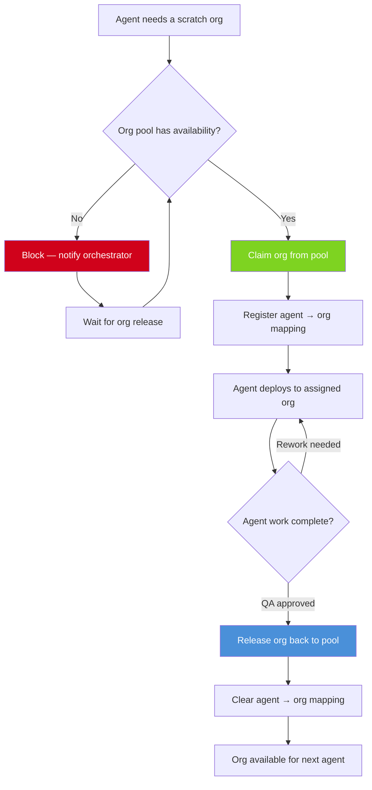
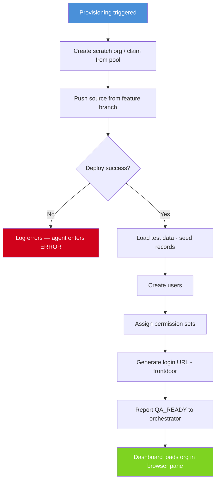
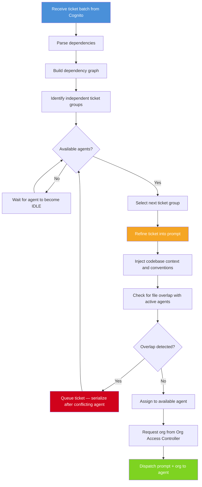
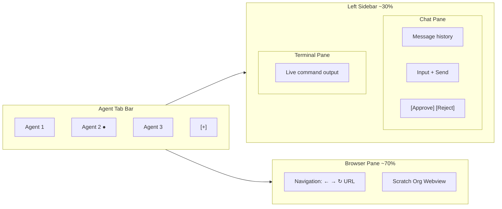

# SweatShop — Diagrams

## 1. Current Workflow (Pre-SweatShop)



## 2. SweatShop End-to-End Flow



## 3. Agent Lifecycle State Machine



## 4. Org Access Controller Flow



## 5. Scratch Org Provisioning Script



## 6. Orchestrator Dispatch Logic



## 7. Dashboard UI Component Layout



## 8. Git Branching Strategy

```mermaid
gitgraph
    commit id: "main"
    branch feature/TICKET-001-login-page
    commit id: "Agent 1: implement login"
    commit id: "Agent 1: add tests"
    checkout main
    branch feature/TICKET-002-dashboard
    commit id: "Agent 2: build dashboard"
    commit id: "Agent 2: add charts"
    checkout main
    branch feature/TICKET-003-api-endpoints
    commit id: "Agent 3: create endpoints"
    checkout main
    merge feature/TICKET-001-login-page id: "QA approved"
    merge feature/TICKET-002-dashboard id: "QA approved"
    merge feature/TICKET-003-api-endpoints id: "QA approved"
```
